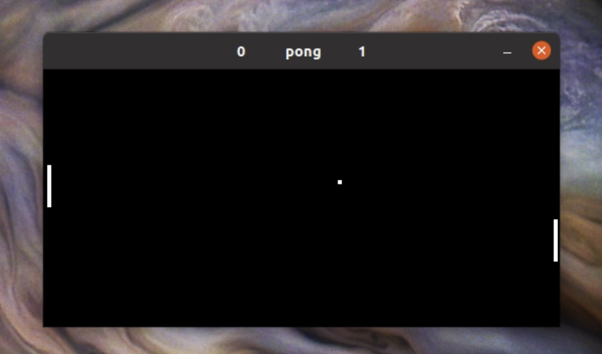

# pong



## Usage

This is the classic game of pong. To play, run

```
python3 pong.py
```

This will start 1-player mode. The bot is on the left, the player is on the right. Play using the up and down arrow keys. To oberve two bots playing against each other, change the last line in **pong.py** from

```python
g = pong_game("player",True)
```

to

```python
g = pong_game("bot",True)
```

Now when you run the game, two equally skilled bots will play againt each other. 

There's a variety of knobs that can be tuned in pong_game.__init__() to change the size and speed of the game, as well as the behavior of the players. I didn't build this code base for active development, it's sort of just a fun toy game I wanted to make, and was interested in using as a (VERY) simple reinforcement learning platform. I may come back to that later. 

## Setup
Built with:
* python 3.9.5
* numpy 1.20.3
* pygame 2.0.1

It should be compatible with any python3 but I haven't tested it (and won't) so your milage my vary. 

If there are any issues feel free to let me know, either by opening an issue or emailing me at kyle.morgenstein@gmail.com. Enjoy!
